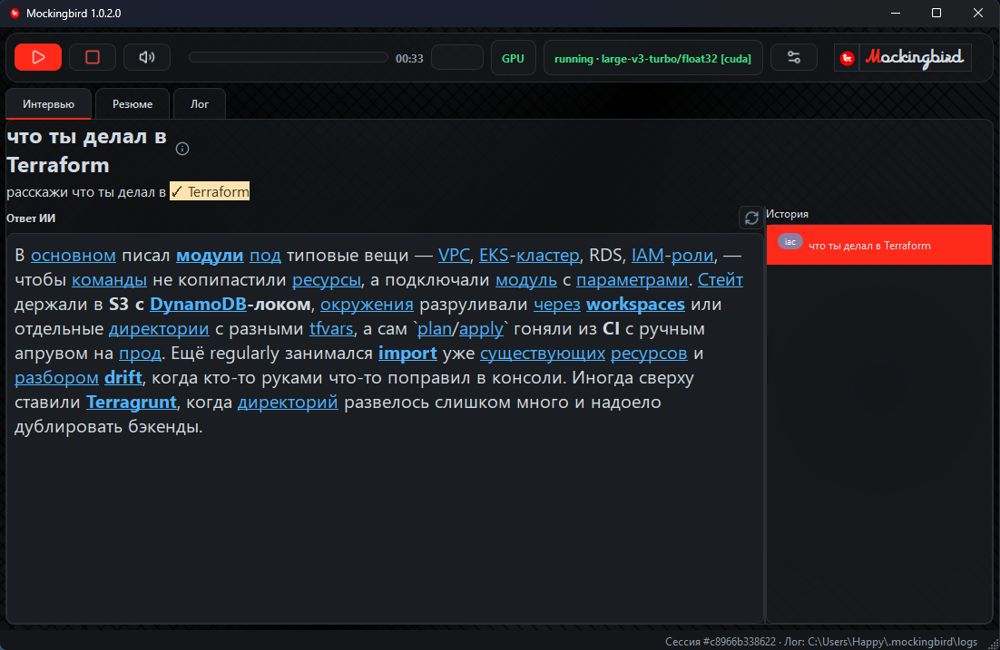

# mockingbird-landing

Лендинг проекта **Mockingbird** для GitHub Pages. Живёт в отдельном репозитории,
не смешивается с кодом приложения.

## Концепция

Single-viewport «app-shell»: лендинг сам выглядит как экран приложения Mockingbird.
Никакого скролла — вся информация размещена в одной видимой области:

```
┌─────────────────────────────────────────────────────────┐
│ header: лого · tagline · версия · GitHub                │
├──────────┬──────────────────────────┬───────────────────┤
│ слева:   │ центр:                   │ справа:           │
│ табы фич │ СКРИНШОТ приложения      │ пайплайн-анимация │
│ STT/KB/  │ + typing «вопроса»       │ + метрики         │
│ LLM/priv │ + spot-маркеры зон       │ + кнопка Download │
├──────────┴──────────────────────────┴───────────────────┤
│ footer: стек · копирайт                                 │
└─────────────────────────────────────────────────────────┘
```

## HTML-реплика окна приложения

Центр лендинга — не скриншот, а живая HTML-реплика UI, собранная **по исходникам
приложения** (в самом приложении ничего не менялось):

- Стили — прямым переносом из `ui/theme.py` `build_qss()` (QSS→CSS):
  тулбар `#toolbar` (radius 14px, header_bg rgba), кнопки QPushButton (radius 8,
  card-фон, hover с красной рамкой), вкладки QTabBar (underline-акцент 2px,
  radius 8/8/0/0), pane QTextBrowser (surface, radius 8).
- Виджеты — по `main_window.py`/`widgets.py`: тулбар (start/stop/mute/settings,
  ActivityBar-термометр c зелёно-янтарно-красным градиентом, таймер сессии,
  DeviceBadge «GPU», StatusPill «running», LogoBadge-капсула radius 17px),
  сплиттер «Ответ ИИ | История» 4:1 с 2px-хэндлом (interview_panel.py).
- Логотип в капсуле — шрифтом **Kholodos** (фирменный `assets/fonts/Kholodos.otf`,
  скопирован из приложения), красная «M» + светлое «ockingbird» — как в Qt-версии.
- Иконки — настоящие lucide-SVG из `assets/icons/` приложения (play, square,
  volume-2, settings-2), красятся через CSS-фильтр (currentColor → белый).
- Живые сценарии: вопрос «печатается» в шапке, «стрим» ответа по словам с
  красной кареткой, тикающий таймер сессии, VU-анимация, live-строка со статусом.

Замена палитры при смене темы приложения — переменные `:root` в
`assets/css/style.css`.

Лендинг использует **реальную палитру приложения** (`src/mockingbird/ui/theme.py`,
DARK_THEME): bg `#141619`, surface `#1A1D21`/`#16181C`, border `#2B2F34`,
text `#d1d9e1`/`#8a99a8`, акцент — фирменный красный `#ff2a1a` (совпадает с
цветом логотипа), статусы `#3DDC84` (running) / `#FFB020` (muted) / `#5C6670`
(idle). Лого — `assets/img/logo.png`, извлечён из `scripts/logo_mockingbird.ico`
основного репо; favicon — `assets/img/favicon.png`.

## Дизайн: corporate punk

Костюм с красным швом — 95% дисциплины + 5% контролируемого хаоса:

- **Шрифты** (self-host, `assets/fonts/`, woff2 cyrillic+latin): Inter 400/600/700 —
  основа; JetBrains Mono 400/700 — tagline, метрики, пилюли, пайплайн, футер.
  Латинские подписи в нижнем регистре против CAPS-заголовков.
- **Красный шов**: две тонкие диагональные линии `#ff2a1a` через весь экран за
  контентом (`.seam`). Красного ≤7% площади.
- **Билборд**: скриншот в жёсткой рамке 2px + сплошная красная офсет-тень 10px
  без blur; жёлтый стикер-бейдж `local-first`, повёрнутый на 6°.
- **Терминальный пайплайн**: строка `$ voice → vad → whisper → kb → llm → answer
  [ok 5.6s]` с мигающим курсором, бегущим свипом и подсветкой стадий.
- **CTA**: светлая кнопка с резкими углами; hover — «взрыв» (сдвиг −4px + красная
  офсет-тень 5px).
- **Глитч**: заголовок «Mockingbird» RGB-расщепляется (красный/зелёный кадры)
  раз в 10 с.
- **Сетка 8px** (`--grid`), углы: панели 8px (как QSS приложения), стикер/CTA/пилюли — 0px.
- Фоновая «миллиметровка» — repeating-linear-gradient, почти незаметная.
- `prefers-reduced-motion` отключает глитч, свип, typing, авто-ротацию.

При смене темы в приложении — синхронизировать переменные в
`assets/css/style.css` (`:root`, блок с комментариями).

## Особенности приложения, отражённые на лендинге

- faster-whisper large-v3-turbo, CUDA-ускорение, adaptive VAD (Silero)
- Фонетическая коррекция терминов в живом черновике (Zabix → Zabbix)
- PDF-резюме → база знаний → контекст LLM
- Стрим ответа LLM, single-flight приоритет вопроса
- Всё локально, кроме запроса к LLM
- Метрики: ~5–6 с от вопроса до ответа; вкладки Интервью / Резюме / Лог

## Структура

```
mockingbird-landing/
├── index.html            разметка (header / grid 3 колонки / footer)
├── serve.sh              локальный вьювер (см. ниже)
├── README.md             этот файл
└── assets/
    ├── css/style.css     стили: 100vh без скролла, clamp(), адаптив
    ├── js/main.js        логика: табы, typing, spot-маркеры, авто-ротация
    └── img/              сюда кладётся screenshot.png
```

Стек: чистый HTML/CSS/JS, без сборки — GitHub Pages отдаёт как есть.

## Интерактив

- **Табы фич** (левая колонка): STT / База знаний / LLM / Приватность.
  Клик/стрелки с клавиатуры → меняется описание фичи, печатается новый
  «вопрос интервьюера» на скриншоте, подсвечивается spot-маркер зоны UI.
- **Typing-эффект**: вопрос «печатается» в чипе над макетом (`.ph-chip--q`).
- **Spot-маркеры**: пульсирующие кружки на зонах скриншота (`.spot`).
- **Пайплайн** (правая колонка): цепочка 🎤→VAD→Whisper→KB→LLM→💬,
  по ней бежит «импульс» (CSS-анимация `.pulse`).
- **Авто-ротация** фич каждые 6 с, отключается при первом взаимодействии.
- `prefers-reduced-motion` — все анимации отключаются.

## Просмотр из WSL в браузере Windows

```bash
bash serve.sh            # http://localhost:8080
bash serve.sh 3000       # свой порт
```

WSL2 пробрасывает localhost автоматически — просто открой
`http://localhost:8080` в браузере Windows. Не работает (старый WSL1/файрвол) —
скрипт напечатает запасной адрес `http://<WSL_IP>:8080`.

## Замена скриншота-заглушки

Сейчас вместо скриншота — стилизованный макет UI (`.screenshot-placeholder`
в `index.html`). Чтобы поставить реальный:

1. Положить `assets/img/screenshot.png` (примерно 16:10).
2. В `index.html` заменить весь блок `.screenshot-placeholder` на:
   ```html
   
   ```
3. Spot-маркеры (`.spot--stt/--kb/--llm/--priv`) перенести в новый контейнер
   и подогнать координаты (top/left в `style.css`).

## Публикация на GitHub Pages

```bash
git init
git add . && git commit -m "landing: initial"
gh repo create Mockingbird-go-on/mockingbird-landing --public --source . --push
```

Затем в настройках репо: **Settings → Pages → Deploy from branch → main / (root)**.
URL: `https://mockingbird-go-on.github.io/mockingbird-landing/`.

Коммитить от имени «Mockingbird Dev» (как основной проект):
```bash
git config user.name "Mockingbird Dev"
git config user.email "dev@mockingbird.app"
```

## Адаптив

- `>1020px` — полная сетка 3 колонки.
- `≤1020px` — колонки складываются в ряды, фичи горизонтально, лендинг
  всё ещё без скролла.
- `≤640px` — компактный режим (подписи spot-маркеров скрыты).

Скролл заблокирован глобально: `html, body { overflow: hidden }`,
высота — `100vh / 100dvh`.
